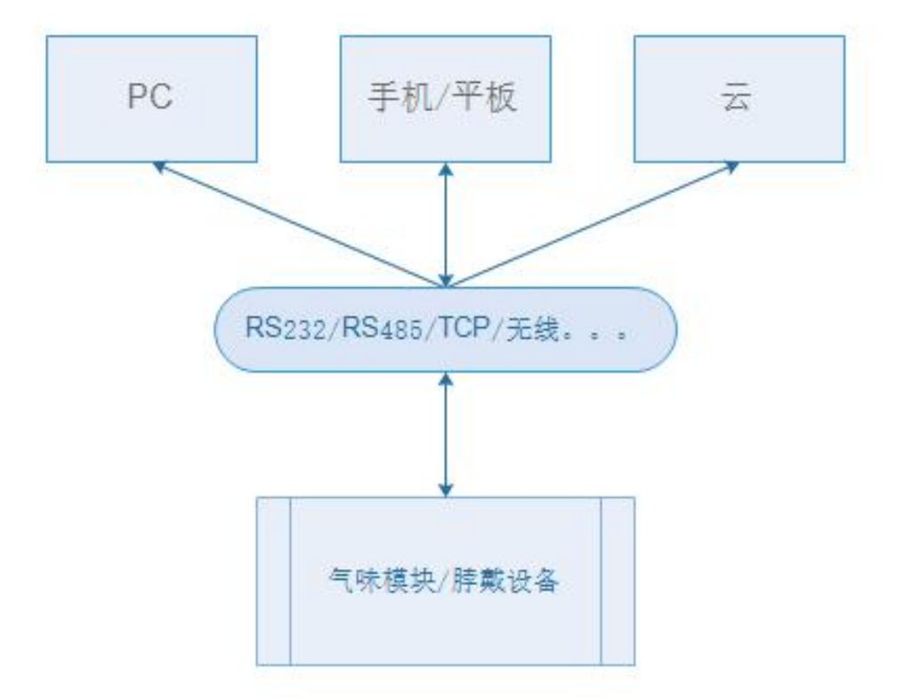

# Bluetooth

# 气味小播开放能力

蓝牙相关协议

## 功能

- 获取设备信息
- 获取胶囊信息
- 播放、停止播放 气味
- 气味闹钟
- 气味混合
- 睡眠模式

## 目前蓝牙最为普遍使用的有两种规格：

- **蓝牙基础率/增强数据率 (Bluetooth Basic Rate/Enhanced Data Rate, BR/EDR)**: 也称为经典蓝牙。常用在对数据传输带宽有一定要求的场景上，比如需要传输音频数据的蓝牙音箱、蓝牙耳机等；
- **蓝牙低功耗 (Bluetooth Low Energy, BLE)**: 从蓝牙 4.0 起支持的协议，特点就是功耗极低、传输速度更快，常用在对续航要求较高且只需小数据量传输的各种智能电子产品中，比如智能穿戴设备、智能家电、传感器等，应用场景广泛。

*气味小播使用 BLE。*

## 协议总体结构说明

### 0.1 系统构成

设备终端模块通过 RS232/RS485/TCP 或者 4G/WIFI 等无线连接到 PC/手机平板或者 云服务端，协议在应用层



### 0.2 通信参数约定

使用串口通信时，通信参数：19200,N,8,1

### 0.3 数据帧结构

| 项名称 | 包头 | 源地址 | 目标地址 | 指令码 | 数据长度 | 数据 | 校验 | 包尾 |
| --- | --- | --- | --- | --- | --- | --- | --- | --- |
| 字节数 | 1 | 2 | 2 | 1 | 1 | N<256 | 2 | 1 |
| 示例 | 0xF5 | 0x00,0x00 | 0x02,0x03 | 0x01 | 0x01 | 0x00 | 0x07 | 0x55 |

### 0.4 帧结构说明

| 名称 | 说明 |  |
| --- | --- | --- |
| 帧头 | 固定数据0xF5 |  |
| 源地址 | 2字节，从0到0xFFFF，其中地址0xFFFF表示所有设备 |  |
| 目标地址 | 2字节，从0到0xFFFF，其中地址0xFFFF表示所有设备，广播数据包 |  |
| 指令码 | 1字节，详细下面章节说明 |  |
| 数据长度 | 1字节，表示帧数据段的数据长度，最大255 |  |
| 数据 | N(N<256)字节,表示指令参数 |  |
| 校验 | 2字节，使用CRC校验，校验方法见附录 | 计算包括从源地址到数据段 |
| 帧尾 | 固定数据0x55 |  |

参数化控制气味播放器播放，多气路循环、交替控制、轮流播放，CRC校验去包头和包尾及校验4字节除外。

### 0.5 设备类型与地址

| 服务端设备类型 | 代码(单个16进制) | 下端设备类型 | 代码(单个16进制) |
| --- | --- | --- | --- |
| PC上位机端 | 0x01 | 脖戴式气味播放器 | 0x01 |
| 同步器 | 0x02 | 气味钢琴 | 0x02 |
| 手机端(BLE) | 0x03 | 数字香水 | 0x03 |
| 阿里云部署服务 | 0x04 | 车载模块 | 0x04 |
| IOT | 0x08 |  |  |

在发送数据地址中，为了方便业务区分，增加标识，如本机类型PC，下发到车载模块，合成本机设备地址高位为 0x14, 如果上位机是IOT系统，则本机设备地址高位为 0x84。本机设备低地址为序号(如IOT向车载设备发送指令，IOT序号为0x01则本机设备地址为0x84,0x01)，未使用到可自行定义本机设备地址。

# 常用指令编码

## 1. 停止播放/重启与初始化

描述

停止当前播放或者重启，或者初始化参数

主机请求

| 字节序号 | 含义 | 示例 |
| --- | --- | --- |
| 0 | 包头 | 0xf5 |
| 1 | 本机设备地址高8位 | 0x84 IOT -> 车载模块(08->04) |
| 2 | 本机设备地址低8位 | 0x00 |
| 3 | 目标设备地址高8位 | 0x00 |
| 4 | 目标设备地址低8位 | 0x01 |
| 5 | 功能码 | 0x00 |
| 6 | 数据长度 | 0x01 |
| 7 | 功能标志 | 0x00:停止;0x01:初始化;0x02:重启 |
| 8 | 校验字高8位 | 0x00 |
| 9 | 校验字低8位 | 0x05 |
| 10 | 包尾 | 0x55 |

> 注：其中序号7功能标志段中占一字节；
值 0x00: 停止播放；0x01: 初始化；0x02：重启
>

从站响应

| 字节序号 | 含义 | 示例 |
| --- | --- | --- |
| 0 | 包头 | 0xF5 |
| 1 | 本机设备地址高8位 | 0x48 |
| 2 | 本机设备地址低8位 | 0x00 |
| 3 | 目标设备地址高8位 | 0x00 |
| 4 | 目标设备地址低8位 | 0x01 |
| 5 | 功能码 | 0x00 |
| 6 | 数据长度 | 0x01 |
| 7 | 执行结果标志 | 0x00执行成功;大于0x01执行失败 |
| 8 | 校验字高8位 | 0x00 |
| 9 | 校验字低8位 | 0x05 |
| 10 | 包尾 | 0x55 |

## 2. 播放气味高级（多路轮播循环）

描述

参数化控制气味播放器播放，多气路循环、交替控制、轮流播放，累加去包头和包尾及校验4字节除外。

主机请求

| 字节序号 | 含义 | 示例 |
| --- | --- | --- |
| 1 | 包头 | 0xf5 |
| 2 | 本机设备地址高8位 | 0x84 |
| 3 | 本机设备地址低8位 | 0x01 |
| 4 | 目标设备地址高8位 | 0x00 |
| 5 | 目标设备地址低8位 | 0x00 |
| 6 | 功能码 | 0x01 |
| 7 | 数据长度 |  |
| 8 | 有效数据 气味强度 | 0x00 |
| 9 |  | 0x01（1-3） |
| 10 | 播放气路数（N） | 0x01（1-255） |
| 11 | 气味编号1 | 0x00 |
| 12 | 气味编号1 | 0x01（1-12） |
| 13 | 气味编号2 | 0x00 |
| 14 | ……（根据气路数列表） | 0x01（1-12） |
| 15 | 播放时间总长（单位：ms） | 0x00 |
| 16 |  | 0x00 |
| 17 |  | 0x00 |
| 18 |  | 0x0a（10ms） |
| 19 | 预热时长（单位：ms） | 0x00 |
| 20 |  | 0x00 |
| 21 |  | 0x00 |
| 22 |  | 0x0a（10ms） |
| 23 | 每次播放时长（单位：ms） | 0x00 |
| 24 |  | 0x00 |
| 25 |  | 0x00 |
| 26 |  | 0x0a（10ms） |
| 27 | 每次间隔时长（单位：ms） | 0x00 |
| 28 |  | 0x00 |
| 29 |  | 0x00 |
| 30 |  | 0x0a（10ms） |
| 31 | 校验字高8位 | 0x00 |
| 32 | 校验字低8位 | 0x05 |
| 33 | 包尾 | 0x55 |

从站响应

| 字节序号 | 含义 | 示例 |
| --- | --- | --- |
| 1 | 包头 | 0xf5 |
| 2 | 本机设备地址高8位 | 0x84 |
| 3 | 本机设备地址低8位 | 0x00 |
| 4 | 目标设备地址高8位 | 0x00 |
| 5 | 目标设备地址低8位 | 0x00 |
| 6 | 功能码 | 0x01 |
| 7 | 数据长度 | 0x01 |
| 8 | 有效数据  操作结果 | 0x00 :执行成功; 0x01错误 |
| 9 | 校验字高8位 | 0x00 |
| 10 | 校验字低8位 | 0x05 |
| 11 | 包尾 | 0x55 |

## 3. 播放单路气味

描述

模块单路播放，当气味编号大于256时，目标地址低8位作为扩展气味编号高位。
注：在324路使用时，气味编号 = 分组个数(自定义 小于255) * 组数(目标地址低8位) + 气味编号字段数据；例如：气味编号217，分组个数108，则217=108*2+1(编码为目标地址低8位为0x02，气味编号字段为0x01)；

主机请求

| 字节序号 | 含义 | 示例 |
| --- | --- | --- |
| 0 | 包头 | 0xf5 |
| 1 | 本机设备地址高8位 | 0x84 |
| 2 | 本机设备地址低8位 | 0x01 |
| 3 | 目标设备地址高8位 | 0x00 |
| 4 | 目标设备地址低8位 | 0x00 当气路数>256 |
| 5 | 功能码 | 0x02 |
| 6 | 数据长度 | 0x05 |
| 7 | 气味编号 | 0x01 |
| 8 | 持续时间 | 0x00 |
| 9 | 持续时间 | 0x00 |
| 10 | 持续时间 | 0x00 |
| 11 | 持续时间 | 0x0A ms |
|  | 播放脚本编号 | 0x01 |
| 12 | 校验字高8位 | 0x00 |
| 13 | 校验字低8位 | 0x05 |
| 14 | 包尾 | 0x55 |

从站响应

| 字节序号 | 含义 | 示例 |
| --- | --- | --- |
| 0 | 包头 | 0xf5 |
| 1 | 本机设备地址高8位 | 0x84 |
| 2 | 本机设备地址低8位 | 0x00 |
| 3 | 目标设备地址高8位 | 0x00 |
| 4 | 目标设备地址低8位 | 0x00 |
| 5 | 功能码 | 0x02 |
| 6 | 数据长度 | 0x01 |
| 7 | 有效数据  操作结果 | 0x00 :成功;0x01~ :其它 |
| 8 | 校验字高8位 | 0x00 |
| 9 | 校验字高8位 | 0x05 |
| 10 | 包尾 | 0x55 |

## 4. 查询设备工作状态

描述

查询气味播放器的当前状态

主机请求

| 字节序号 | 含义 | 示例 |
| --- | --- | --- |
| 0 | 包头 | 0xf5 |
| 1 | 本机设备地址高8位 | 0x13 |
| 2 | 本机设备地址低8位 | 0x01 |
| 3 | 目标设备地址高8位 | 0x00 |
| 4 | 目标设备地址低8位 | 0x01 |
| 5 | 功能码 | 0x03 (查询状态) |
| 6 | 数据长度 | 0x00 |
| 7 | 校验字高8位 | 0x00 |
| 8 | 校验字低8位 | 0x05 |
| 9 | 包尾 | 0x55 |

从站响应

气味播放器响应中有效数据为1字节，包含设备状态（1字节）

| 设备状态 | 对应代码 |
| --- | --- |
| 待机 | 0x00 |
| 播放气味（高级） | 0x07 |
| 料芯故障 | 0x09 |
| 其他错误 | 0xff |
| 脚本不存在 | 0xfe |

| 字节 | 含义 | 示例 |
| --- | --- | --- |
| 0 | 包头 | 0xf5 |
| 1 | 本机设备地址高8位 | 0x13 |
| 2 | 本机设备地址低8位 | 0x01 |
| 3 | 目标设备地址高8位 | 0x00 |
| 4 | 目标设备地址低8位 | 0x01 |
| 5 | 功能码 | 0x03（查询状态） |
| 6 | 数据长度 | 3 |
| 7 | 有效数据   设备状态(参见设备状态表) | 0x00 |
| 8 | 气味编号 高字节 | 0x00 |
| 9 | 气味编号 低字节 | 0x01 |
| 10 | 已播放脚本时长(s) 高字节 | 0x00 |
| 11 | 已播放脚本时长(s) 低字节 | 0x01 |
| 12 | 脚本总时长(s) 高字节 | 0x01 |
| 13 | 脚本总时长(s) 低字节 | 0x05 |
| 14 | 校验字高 8 位 | 0x00 |
| 15 | 校验字低 8 位 | 0x05 |
| 16 | 包尾 | 0x55 |


## 5. 获取设备信息 0x16

描述

获取设备版本号

主机请求

| 字节序号 | 含义 | 示例 |
| --- | --- | --- |
| 0 | 包头 | 0xf5 |
| 1 | 本机设备地址高8位 | 0x18 |
| 2 | 本机设备地址低8位 | 0x00 |
| 3 | 目标设备地址高8位 | 0x00 |
| 4 | 目标设备地址低8位 | 0x01 |
| 5 | 功能码 | 0x16 |
| 6 | 数据长度 | 0x00 |
| 7 | 校验字高8位 | 0x00 |
| 8 | 校验字低8位 | 0x00 |
| 9 | 包尾 | 0x55 |

从站响应

| 字节 | 含义 | 示例 |
| --- | --- | --- |
| 0 | 包头 | 0xf5 |
| 1 | 本机设备地址高8位 | 0x81 |
| 2 | 本机设备地址低8位 | 0x01 |
| 3 | 目标设备地址高8位 | 0xff |
| 4 | 目标设备地址低8位 | 0xff |
| 5 | 功能码 | 0x16 |
| 6 | 数据长度 | 0x01 |
| 7 | 版本号 | 0x01 |
| 8 | 版本号 | 0x01 |
| 9 | 版本号 | 0x01 |
| 10 | 校验字高 8 位 | 0x00 |
| 11 | 校验字低 8 位 | 0x05 |
| 12 | 包尾 | 0x55 |

## 注意事项

每个蓝牙外围设备都有唯一的 `deviceId`来标识。由于部分系统实现的限制，对于同一台蓝牙外围设备，在不同中心设备上扫描获取到的 `deviceId`可能是变化的。因此 `deviceId`不能硬编码到代码中。


### CRC校验函数 使用多项式 0xA001;C#/C++算法如下所示
```c
public static ushort CalcCrc(byte[] data) {
  int len = data.Length;
  if (len > 0) {
    ushort crc = 0xFFFF;
    for (int i = 0; i < len; i++) {
      crc = (ushort)(crc ^ (data[i]));
      for (int j = 0; j < 8; j++) {
        crc = (crc & 1) != 0 ? (ushort)((crc >> 1)^ 0xA001):(ushort)(crc >> 1);
      }
    }

    byte hi = (byte)((crc & 0xFF00) >> 8); //高位置
    byte lo = (byte)(crc & 0x00FF); //低位置
    return (ushort)(hi * 256 + lo);
  }
  return 0;
}
```
